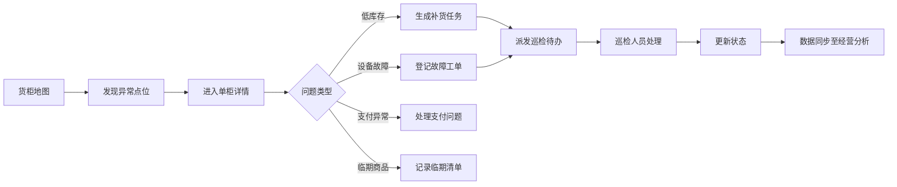

## 1. 产品概述

智慧零售运营管理平台，面向品牌方运营人员，实现无人货柜全生命周期的日常运营管理。通过数字化手段提升货柜运营效率，降低库存损耗，优化巡检路线，实现从发现问题到安排处理的完整闭环。

- 主要用途：无人货柜的日常运营管理，包括货柜监控、商品管理、补货调度、异常处理、数据分析
- 解决的核心问题：运营人员无法实时掌握货柜状态、补货效率低、异常处理不及时、经营决策缺乏数据支撑
- 目标用户：品牌方运营管理人员、巡检人员、数据分析人员

## 2. 核心功能

### 2.1 用户角色

| 角色 | 核心权限 |
|------|----------|
| 运营管理员 | 全局数据查看、货柜管理、商品配置、异常处理、价格调整、日报导出、任务派发 |
| 巡检人员 | 查看个人待办、巡检路线、补货清单、设备故障登记 |
| 数据分析人员 | 经营数据查看、报表导出、收益对比、销售趋势分析 |

### 2.2 功能模块

1. **货柜地图**：货柜地理分布展示、在线状态查看、低库存点位筛选、单柜详情入口
2. **商品监控**：商品库存监控、上下架配置、临期商品记录、价格调整
3. **补货路线**：补货清单生成、巡检顺序规划、路线优化、待办派发
4. **异常处理**：设备故障登记、支付异常处理、异常状态跟踪
5. **经营分析**：单柜销售曲线、点位收益对比、运营日报导出

### 2.3 页面详情

| 页面名称 | 模块名称 | 功能描述 |
|-----------|-------------|---------------------|
| 货柜地图 | 地图概览 | 展示所有货柜的地理分布，支持缩放和拖动 |
| 货柜地图 | 状态筛选 | 按在线/离线/低库存/故障等状态筛选货柜点位 |
| 货柜地图 | 货柜卡片 | 点击点位展示货柜简要信息，支持进入详情页 |
| 货柜地图 | 统计概览 | 顶部展示货柜总数、在线率、低库存数、异常数等关键指标 |
| 商品监控 | 库存列表 | 展示所有商品的库存状态，支持按货柜、按分类筛选 |
| 商品监控 | 上下架管理 | 配置商品在各货柜的上下架状态 |
| 商品监控 | 临期预警 | 记录和展示临期商品，支持导出临期清单 |
| 商品监控 | 价格调整 | 批量或单独调整商品售价 |
| 补货路线 | 补货清单 | 自动生成需要补货的货柜和商品清单 |
| 补货路线 | 路线规划 | 根据补货点位智能规划巡检顺序 |
| 补货路线 | 待办派发 | 将巡检任务派发给指定巡检人员 |
| 补货路线 | 进度追踪 | 查看补货任务的完成进度 |
| 异常处理 | 设备故障 | 登记设备故障信息，支持上传照片、分配处理人 |
| 异常处理 | 支付异常 | 展示支付异常订单，支持退款、重试等操作 |
| 异常处理 | 异常跟踪 | 按状态（待处理/处理中/已解决）跟踪异常处理进度 |
| 经营分析 | 销售曲线 | 单柜维度的日/周/月销售趋势图表 |
| 经营分析 | 收益对比 | 多点位收益对比分析，支持图表可视化 |
| 经营分析 | 日报导出 | 生成并导出每日运营日报 |
| 单柜详情 | 基本信息 | 货柜位置、设备状态、在线时长等基础信息 |
| 单柜详情 | 实时库存 | 当前货柜内商品库存明细 |
| 单柜详情 | 销售数据 | 该货柜的销售数据和趋势 |
| 单柜详情 | 异常记录 | 该货柜的历史异常和处理记录 |
| 单柜详情 | 快捷操作 | 快速发起补货、报修、价格调整等操作 |

## 3. 核心流程

运营人员从货柜地图发现问题点位，点击进入单柜详情页查看具体情况，根据问题类型（库存不足/设备故障/支付异常等）发起相应处理流程，系统记录处理过程并跟踪至闭环，所有操作数据同步至经营分析模块。

## 4. 用户界面设计

### 4.1 设计风格

- **主色调**：深邃科技蓝 (#165DFF)，体现专业与科技感
- **辅助色**：翡翠绿 (#00B42A) 表示正常/在线，警告橙 (#FF7D00) 表示低库存/临期，危险红 (#F53F3F) 表示故障/异常
- **中性色**：采用冷灰系列，背景 #F5F7FA，卡片 #FFFFFF，文字 #1D2129 / #4E5969 / #86909C
- **按钮风格**：圆角 6px，主按钮采用品牌蓝填充，次要按钮采用描边样式
- **字体**：标题使用 "PingFang SC" / "Microsoft YaHei" 粗体，正文使用常规字重，数字采用等宽字体增强可读性
- **布局风格**：顶部导航 + 左侧菜单的经典后台布局，内容区采用卡片式设计，信息密度适中
- **图标风格**：使用 Lucide React 线性图标，保持统一的线宽和风格
- **整体氛围**：专业、高效、数据驱动的运营后台风格

### 4.2 页面设计概述

| 页面名称 | 模块名称 | UI元素 |
|-----------|-------------|-------------|
| 货柜地图 | 地图概览 | 全屏交互式地图，不同颜色标记不同状态货柜，点位带脉冲动画 |
| 货柜地图 | 统计概览 | 4个数据卡片横向排列，带图标和趋势指示 |
| 货柜地图 | 货柜卡片 | 悬浮弹出卡片，展示货柜名称、状态、库存率、快捷入口 |
| 商品监控 | 库存列表 | 数据表格，支持多条件筛选、排序，库存条进度可视化 |
| 商品监控 | 上下架管理 | 开关式切换，支持批量操作 |
| 补货路线 | 路线规划 | 地图连线展示最优路径，右侧任务列表 |
| 异常处理 | 异常跟踪 | 看板式布局，按状态分列展示，支持拖拽 |
| 经营分析 | 销售曲线 | 面积图/折线图，支持时间范围切换 |
| 经营分析 | 收益对比 | 柱状图 + 数据表格，支持点位多选对比 |

### 4.3 响应式设计

- 采用桌面端优先设计，最小支持 1366px 宽度
- 侧边栏在窄屏可折叠为图标模式
- 数据表格在小屏幕支持横向滚动
- 图表区域自适应容器宽度

## 5. 单柜详情闭环流程

从地图点位进入单柜详情后，运营人员可完成以下闭环操作：
1. 查看货柜实时状态（在线、温度、网络等）
2. 检查商品库存，识别缺货/低库存商品
3. 查看近期销售趋势和异常记录
4. 根据情况一键发起：补货申请、故障报修、商品下架、价格调整
5. 系统自动创建任务并派发给对应巡检人员
6. 任务处理状态实时同步，处理完成后自动归档
