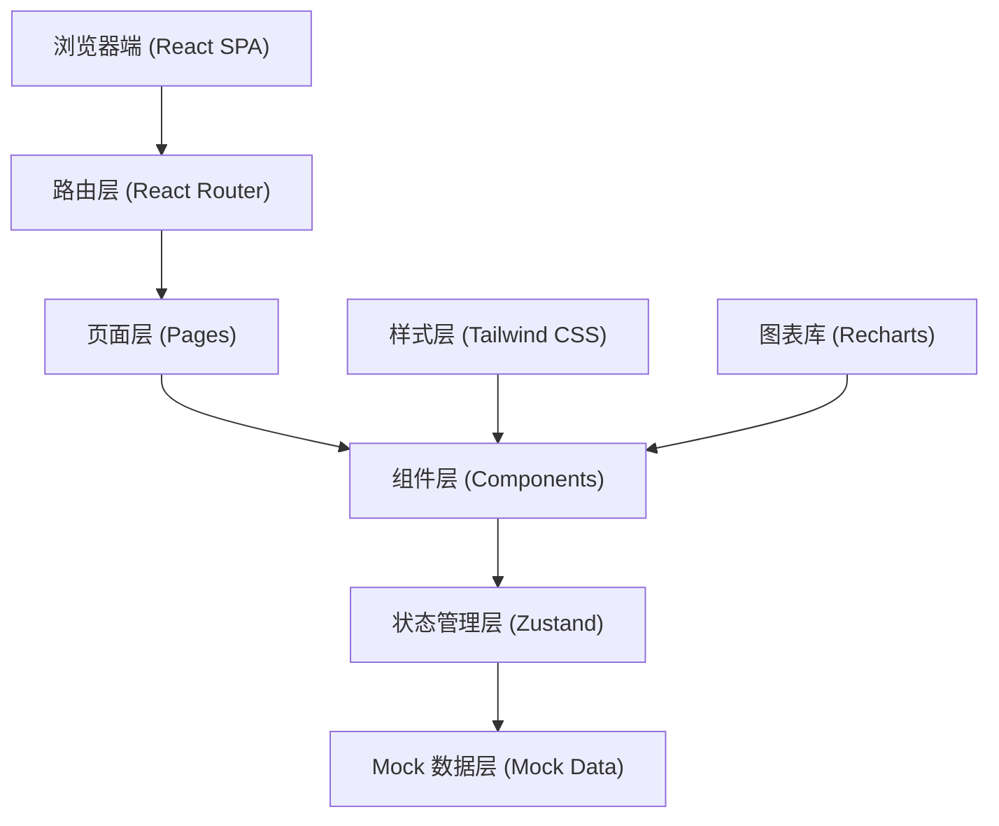
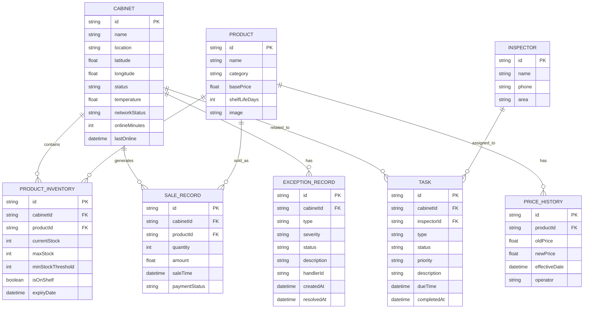

## 1. 架构设计



## 2. 技术描述

- **前端框架**：React@18 + TypeScript@5
- **构建工具**：Vite@5
- **样式方案**：Tailwind CSS@3
- **路由管理**：react-router-dom@6
- **状态管理**：zustand@4
- **图标库**：lucide-react
- **图表库**：recharts@2
- **数据方案**：前端 Mock 数据（不依赖后端服务）
- **初始化工具**：vite-init

## 3. 路由定义

| 路由路径 | 页面名称 | 说明 |
|----------|----------|------|
| / | 货柜地图 | 首页，展示货柜地图和状态概览 |
| /map | 货柜地图 | 货柜地理分布和状态监控 |
| /map/cabinet/:id | 单柜详情 | 单个货柜的详细信息和操作 |
| /products | 商品监控 | 商品库存、上下架、临期、价格管理 |
| /replenishment | 补货路线 | 补货清单、路线规划、任务派发 |
| /exceptions | 异常处理 | 设备故障、支付异常、异常跟踪 |
| /analytics | 经营分析 | 销售曲线、收益对比、日报导出 |

## 4. 数据模型

### 4.1 数据模型定义



### 4.2 TypeScript 类型定义

```typescript
// 货柜状态
type CabinetStatus = 'online' | 'offline' | 'low_stock' | 'fault' | 'maintenance';

// 货柜
interface Cabinet {
  id: string;
  name: string;
  location: string;
  latitude: number;
  longitude: number;
  status: CabinetStatus;
  temperature: number;
  networkStatus: 'good' | 'normal' | 'weak';
  onlineMinutes: number;
  lastOnline: Date;
}

// 商品
interface Product {
  id: string;
  name: string;
  category: string;
  basePrice: number;
  shelfLifeDays: number;
  image: string;
}

// 商品库存
interface ProductInventory {
  id: string;
  cabinetId: string;
  productId: string;
  product?: Product;
  currentStock: number;
  maxStock: number;
  minStockThreshold: number;
  isOnShelf: boolean;
  expiryDate: Date;
}

// 销售记录
interface SaleRecord {
  id: string;
  cabinetId: string;
  productId: string;
  quantity: number;
  amount: number;
  saleTime: Date;
  paymentStatus: 'success' | 'failed' | 'pending' | 'refunded';
}

// 异常类型
type ExceptionType = 'device_fault' | 'payment_error' | 'temperature_abnormal' | 'network_error';
type ExceptionStatus = 'pending' | 'processing' | 'resolved';
type ExceptionSeverity = 'low' | 'medium' | 'high' | 'critical';

// 异常记录
interface ExceptionRecord {
  id: string;
  cabinetId: string;
  cabinet?: Cabinet;
  type: ExceptionType;
  severity: ExceptionSeverity;
  status: ExceptionStatus;
  description: string;
  handlerId?: string;
  createdAt: Date;
  resolvedAt?: Date;
}

// 任务
type TaskType = 'replenishment' | 'maintenance' | 'inspection' | 'price_adjustment';
type TaskStatus = 'pending' | 'assigned' | 'in_progress' | 'completed' | 'cancelled';
type TaskPriority = 'low' | 'medium' | 'high' | 'urgent';

interface Task {
  id: string;
  cabinetId: string;
  cabinet?: Cabinet;
  inspectorId?: string;
  inspector?: Inspector;
  type: TaskType;
  status: TaskStatus;
  priority: TaskPriority;
  description: string;
  products?: { productId: string; quantity: number }[];
  dueTime: Date;
  completedAt?: Date;
}

// 巡检员
interface Inspector {
  id: string;
  name: string;
  phone: string;
  area: string;
}

// 价格历史
interface PriceHistory {
  id: string;
  productId: string;
  oldPrice: number;
  newPrice: number;
  effectiveDate: Date;
  operator: string;
}
```

## 5. 项目目录结构

```
src/
├── assets/              # 静态资源
├── components/          # 公共组件
│   ├── layout/         # 布局组件
│   │   ├── Header.tsx
│   │   ├── Sidebar.tsx
│   │   └── MainLayout.tsx
│   ├── ui/             # 通用 UI 组件
│   │   ├── StatCard.tsx
│   │   ├── DataTable.tsx
│   │   ├── StatusBadge.tsx
│   │   ├── ProgressBar.tsx
│   │   ├── Modal.tsx
│   │   └── EmptyState.tsx
│   └── chart/          # 图表组件
│       ├── LineAreaChart.tsx
│       └── BarChart.tsx
├── pages/              # 页面组件
│   ├── Map/            # 货柜地图
│   │   ├── index.tsx
│   │   ├── CabinetMap.tsx
│   │   ├── CabinetCard.tsx
│   │   └── StatsOverview.tsx
│   ├── CabinetDetail/  # 单柜详情
│   │   ├── index.tsx
│   │   ├── CabinetInfo.tsx
│   │   ├── InventoryPanel.tsx
│   │   ├── SalesChart.tsx
│   │   ├── ExceptionHistory.tsx
│   │   └── QuickActions.tsx
│   ├── Products/       # 商品监控
│   │   ├── index.tsx
│   │   ├── InventoryTable.tsx
│   │   ├── ExpiryWarning.tsx
│   │   └── PriceAdjustment.tsx
│   ├── Replenishment/  # 补货路线
│   │   ├── index.tsx
│   │   ├── ReplenishmentList.tsx
│   │   ├── RoutePlanner.tsx
│   │   └── TaskDispatch.tsx
│   ├── Exceptions/     # 异常处理
│   │   ├── index.tsx
│   │   ├── ExceptionKanban.tsx
│   │   ├── DeviceFaultForm.tsx
│   │   └── PaymentException.tsx
│   └── Analytics/      # 经营分析
│       ├── index.tsx
│       ├── SalesTrend.tsx
│       ├── RevenueCompare.tsx
│       └── DailyReport.tsx
├── store/              # 状态管理
│   ├── cabinetStore.ts
│   ├── productStore.ts
│   ├── exceptionStore.ts
│   ├── taskStore.ts
│   └── analyticsStore.ts
├── mock/               # Mock 数据
│   ├── cabinets.ts
│   ├── products.ts
│   ├── sales.ts
│   ├── exceptions.ts
│   ├── tasks.ts
│   └── inspectors.ts
├── types/              # 类型定义
│   └── index.ts
├── utils/              # 工具函数
│   ├── format.ts
│   ├── date.ts
│   └── map.ts
├── App.tsx
├── main.tsx
└── index.css
```

## 6. 状态管理设计

使用 zustand 进行全局状态管理，按业务领域拆分 store：

- **cabinetStore**: 货柜数据、筛选状态、当前选中货柜
- **productStore**: 商品列表、库存数据、价格调整
- **exceptionStore**: 异常记录、状态流转
- **taskStore**: 补货任务、巡检任务、派发状态
- **analyticsStore**: 销售数据、统计指标

## 7. UI 组件规范

所有 UI 组件遵循以下规范：
- 组件命名：PascalCase，如 `StatCard.tsx`
- 使用 TypeScript 定义 Props 类型
- 使用 Tailwind CSS 进行样式编写
- 组件职责单一，每个组件不超过 300 行
- 可复用组件放在 `src/components/ui/` 目录
